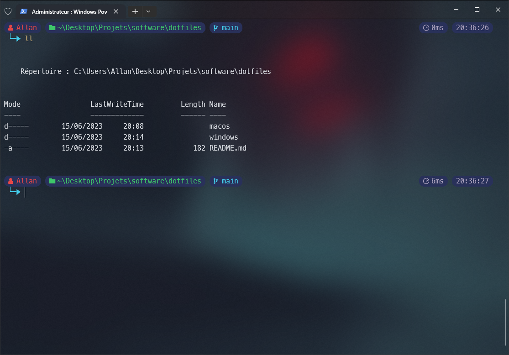

# Windows Terminal

<div align="center">
    
</div>

- Link to [Windows Terminal](https://apps.microsoft.com/store/detail/windows-terminal/9N0DX20HK701?hl=fr-fr&gl=fr&rtc=1)

## Configs

Create the following file : `$HOME\.config\powershell\user_profile.ps1`

Then in `$PROFILE.CurrentUserCurrentHost` add the following line :

```powershell
. "$HOME\.config\powershell\user_profile.ps1"
```

- [Aliases](/aliases/README.md) configs
- [Oh my posh](/oh-my-posh/README.md) configs
- [Modules](/modules/README.md) configs
